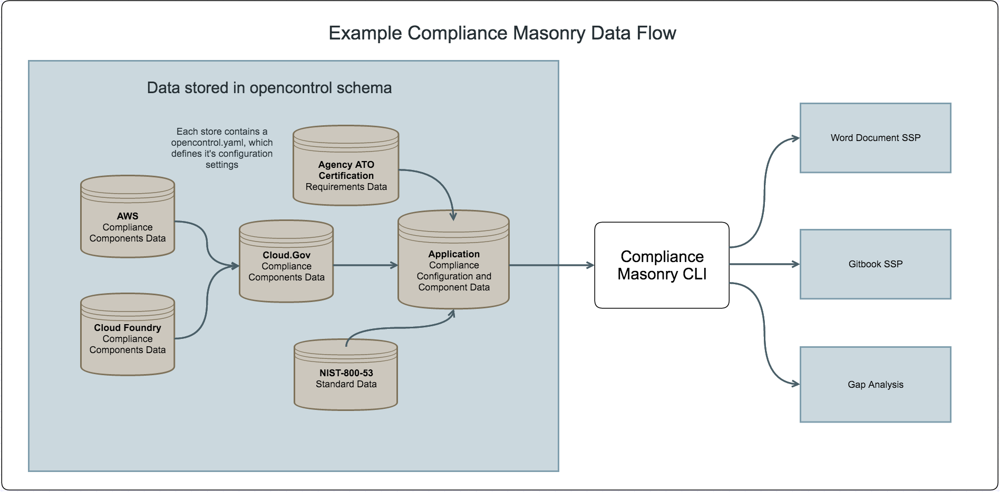

# Compliance Masonry

[](https://github.com/opencontrol/compliance-masonry/releases/latest)
[](https://goreportcard.com/report/github.com/opencontrol/compliance-masonry)
[](https://codeclimate.com/github/opencontrol/compliance-masonry)
[](https://codecov.io/github/opencontrol/compliance-masonry?branch=master)
[](https://circleci.com/gh/opencontrol/compliance-masonry/tree/master)
[](https://ci.appveyor.com/project/opencontrol/compliance-masonry/branch/master)

Compliance Masonry is a command-line interface (CLI) that allows users to construct certification documentation using the [OpenControl Schema](https://github.com/opencontrol/schemas).


## Overview
To learn about Compliance Masonry at a high level:

* [18F blog post about Compliance Masonry](https://18f.gsa.gov/2016/04/15/compliance-masonry-buildling-a-risk-management-platform/)
* [Compliance Masonry for the Compliance Literate](docs/masonry-for-the-compliance-literate.md)



### Benefits

Modern applications are built on existing systems such as S3, EC2, and Cloud Foundry. Documentation for how these underlying systems fulfill NIST controls or PCI SSC Data Security Standards is a prerequisite for receiving authorization to operate (ATO). Unlike most [System Security Plan documentation](http://csrc.nist.gov/publications/nistpubs/800-18-Rev1/sp800-18-Rev1-final.pdf), Compliance Masonry documentation is built using [OpenControl Schema](https://github.com/opencontrol/schemas), a machine readable format for storing compliance documentation.

Compliance Masonry simplifies the process of certification documentations by providing:

1. a data store for certifications (ex FISMA), standards (ex NIST-800-53), and the individual system components (ex AWS-EC2).
1. a way for government projects to edit existing files and also add new control files for their applications and organizations.
1. a pipeline for generating clean and standardized certification documentation.


## Installation

Compliance Masonry is packaged into a downloadable executable program for those who want to use Compliance Masonry without the need to install any external dependencies or programs.

### MacOS

You can install compliance-masonry on MacOS using the following methods:

#### DMG Installation
1. Go to [the Github Release](https://github.com/opencontrol/compliance-masonry/releases/latest).
1. Download the DMG package that ends in `.dmg`.
1. Double-click on the MSI package.
1. Simply drag the compliance-masonry icon to your Applications folder.

#### Installing from Archive
1. Go to [the Github Release](https://github.com/opencontrol/compliance-masonry/releases/latest).
1. Download the archive package that corresponds to your machine and operating system.
    - For 32 Bit MacOS, you'll want the file ending `_darwin_386.zip`
    - For 64 Bit MacOS, you'll want the file ending `_darwin_amd64.zip`
1. Unzip the archive. The resulting folder should contain a file called `masonry`.
1. In your terminal, copy `masonry` to `/usr/local/bin`.

```sh
cd path/to/unarchived/masonry
cp masonry /usr/local/bin
```

NOTE: If you need the legacy binary, make sure to also copy `compliance-masonry` to `/usr/local/bin`!

### Windows

You can install compliance-masonry on Windows using the following methods:

#### MSI Installation
1. Go to [the Github Release](https://github.com/opencontrol/compliance-masonry/releases/latest).
1. Download the MSI package that ends in `.msi`.
1. Double-click on the MSI package and click through the installation prompts.

#### Installing from Archive
1. Go to [the Github Release](https://github.com/opencontrol/compliance-masonry/releases/latest).
1. Download the archive package that corresponds to your machine and operating system.
    - For 32 Bit Windows, you'll want the file ending `_windows_386.zip`
    - For 64 Bit Windows, you'll want the file ending `_windows_amd64.zip`
1. Double-click on the downloaded package to unzip the archive. The resulting folder should contain a file called `masonry.exe`.
1. Create a folder, e.g. `C:\Masonry\bin`.
1. Drag `masonry.exe` into the new folder.
1. Open PowerShell.
    * Search your Start menu / Cortana for it.
1. [Add `C:\Masonry\bin` to your `PATH`.](https://www.java.com/en/download/help/path.xml)

NOTE: If you need the legacy binary, make sure to also copy `compliance-masonry.exe` to `C:\Masonry\bin`!

### Linux

You can install compliance-masonry on Linux using the following methods:

#### Package installation

1. Go to [the Github Release](https://github.com/opencontrol/compliance-masonry/releases/latest).
1. Download the `.deb` or `.rpm` package that corresponds to your machine and operating system.
1. Install the `.deb` or `.rpm` package using the following methods:

##### YUM Installation
```sh
sudo yum -y install compliance-masonry*.rpm
```

##### DNF Installation
```sh
sudo dnf -y install compliance-masonry*.rpm
```

##### DEB Installation
```sh
sudo apt install compliance-masonry*.rpm
```

#### Installing from Archive
1. Go to [the Github Release](https://github.com/opencontrol/compliance-masonry/releases/latest).
1. Download the archive package that corresponds to your machine and operating system.
1. Unzip the archive.
1. In your terminal, copy `masonry` to `/usr/local/bin`.
In your terminal, run the following:

```sh
cd path/to/unarchived/masonry
sudo cp masonry /usr/local/bin
```

NOTE: If you need the legacy binary, make sure to also copy `compliance-masonry` to `/usr/local/bin`!

## Examples

See [this list of OpenControl project examples](https://github.com/opencontrol/schemas/#full-project-examples).

## Further Reading

* [Usage](docs/usage.md)
* [Gitbook](docs/gitbook.md)
* [Developer setup](docs/development.md)
