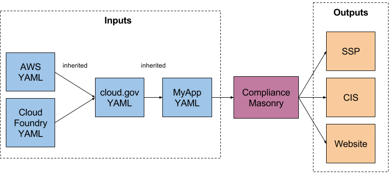

# Compliance Masonry for the Compliance Literate

Compliance Masonry is a set of tools that restructure the process of writing, updating, and reviewing compliance documentation. This tooling enables teams to work faster and cheaper since it reduces repetitive and labor-intensive work. The core innovations are:

* It separates information from presentation: teams can collaborate on documentation as structured data and then automatically format it in multiple ways useful to teammates and compliance reviewers, rather than the traditional approach of manually managing large static Word and Excel documents that conflate information and style.
* Compliance information underlying systems can be inherited by the system, reducing repetitive writing/copying-and-pasting in creating a System Security Plan.

## Step by step

Teams write control justifications as structured data in YAML files, like so:

https://github.com/opencontrol/schemas#components

The control justifications are then grouped into ["components"](https://github.com/opencontrol/schemas#components) (representing the parts of a system that deal with specific security requirements), which Compliance Masonry merges together to represent the overall system. cloud.gov, for example, reuses open source code from the [Cloud Foundry](https://www.cloudfoundry.org/) and [Concourse](http://concourse.ci/) open source projects, so cloud.gov is writing many control statements that explain security measures in Cloud Foundry and Concourse. The cloud.gov team publishes those component-specific control statements as structured data that other Cloud Service Providers (CSPs) using one or both of those open source components can adapt for their control documentation. Systems deployed to cloud.gov can then import cloud.gov’s full set of control descriptions, bringing along the control justifications for everything below.

Componentizing of compliance information also means that any other systems built on top of Amazon Web Services (AWS), for example, could inherit those same control justifications, without needing to re-write them. Furthermore, if something compliance-related changes at the AWS level, this can be updated in one place, and automatically propagate out to the compliance documentation for the downstream systems.

Compliance information now can be stored alongside code, thus making it easier to update alongside relevant changes, in a big step towards continuous compliance.

Once the data is all pulled together, Compliance Masonry could render the data in any format useful to the team or reviewers, such as:

* The complete FedRAMP-templated System Security Plan Word document
* The Control Implementation Status (CIS) spreadsheet file with automatically up-to-date summary info about controls
* The Policies and Procedures summary document with the contents of all the -1 control statements
* A web site, for quick reference, mobile viewing, etc.

Being able to render to the official SSP documents means that the cloud.gov team can collaborate on compliance documentation through GitHub, and automatically generate the Word document to send to the reviewers as needed. If FedRAMP were to update their SSP Template, we could update the Compliance Masonry rendering logic, and then everyone using Compliance Masonry could generate a new document with the new formatting. This means saving every team using Compliance Masonry the painstaking effort of copying and pasting content between hundreds of pages of Word documents.

_Figure: A visual representation of the Compliance Masonry workflow. [View as SVG.](https://rawgit.com/opencontrol/compliance-masonry/compliance-literate-doc/docs/assets/workflow.svg)_

While these are major benefits for the productivity of teams producing compliance documentation, there are also major potential benefits for compliance reviewers:

* Compliance Masonry could automatically generate reports about the completeness of the compliance information.
* Having the CIS generatable at any moment means the team can easily keep it up-to-date and accurate for compliance reviewer evaluation.
* As authors update control statements, Compliance Masonry could generate reports for compliance reviewers that list all changed information between specified dates, to help reviewers only analyze information that changed.
* The state of systems’ controls could be fed into a dashboard.
* If an underlying system’s controls have already been vetted, the tool could generate a report about which controls are specific to that system, meaning less work for the reviewers.
* If there’s a compliance violation of an underlying system (e.g. AWS), the dependent systems (e.g. cloud.gov) could be traced through the dependency tree.

The goal is not just to be able to create documentation in an automated fashion, but to be able to validate that the systems meet the controls as described in an automated way too. Compliance Masonry templates can run [executable specifications](https://en.wikipedia.org/wiki/Behavior-driven_development#Behavioral_specifications) which are used to continuously monitor that systems behave in the way they’re documented.

Hopefully this gives you a better sense of the use case and goals of Compliance Masonry—please [reach out](https://github.com/opencontrol/discuss/issues/new) with any questions!
